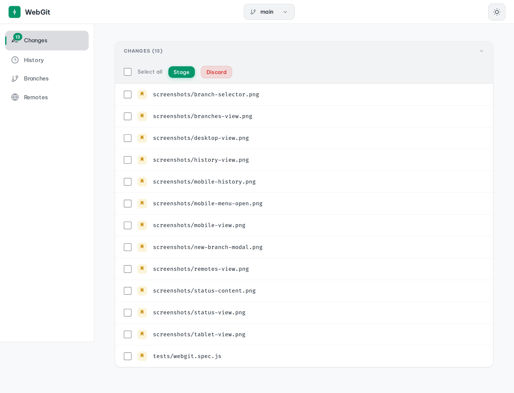
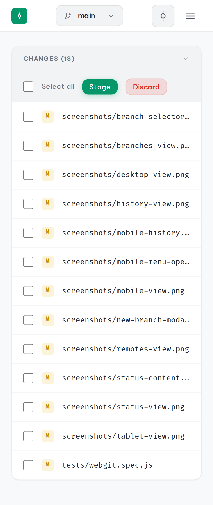
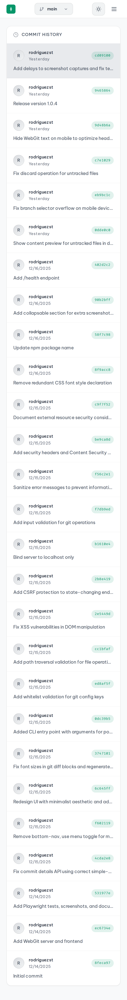
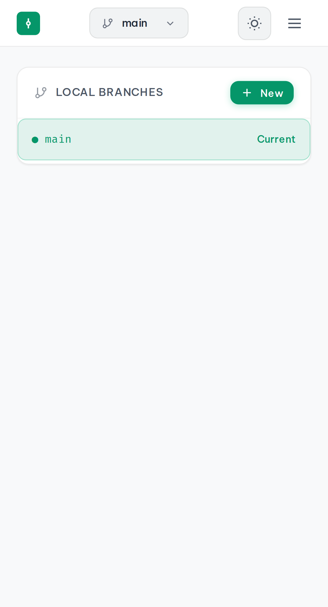
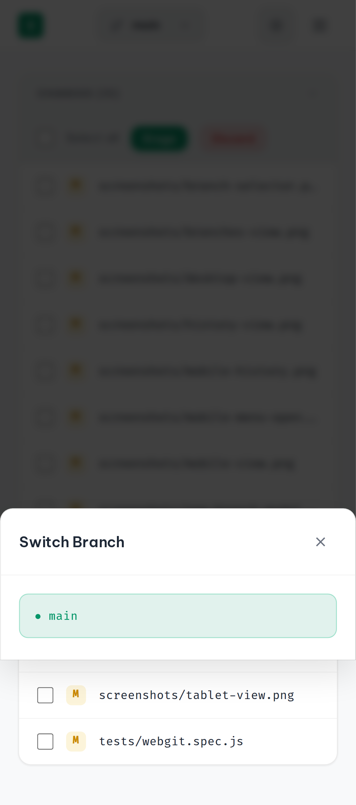
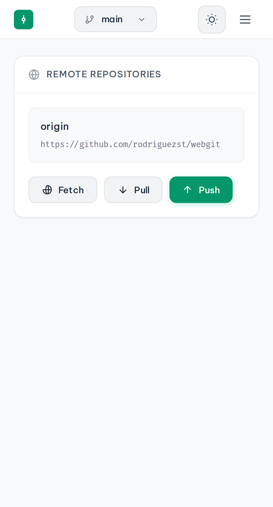
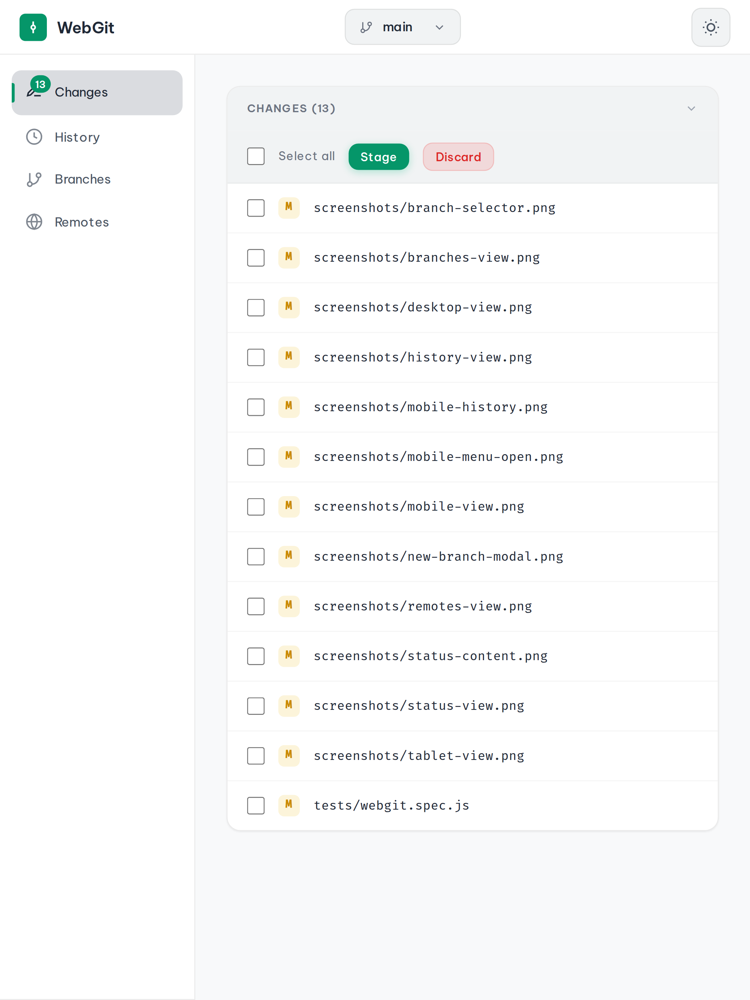
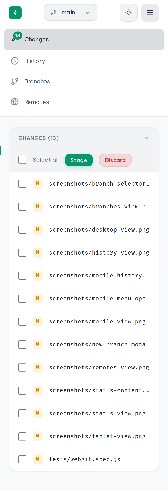

# WebGit

A standalone, lightweight Git web viewer that can be launched from any git repository directory to provide a comprehensive git management experience through a web browser.

## Features

- **Repository Status Dashboard** - View modified, added, deleted, untracked, staged, renamed, and conflicted files with ahead/behind tracking against upstream
- **Diff Viewer** - Side-by-side or unified diff views with syntax highlighting; supports staged diffs and untracked file rendering
- **Staging & Committing** - Selective file staging with checkbox selection and commit interface (single or batch files)
- **Unstage & Discard** - Unstage files from index or discard working directory changes (supports both tracked and untracked files)
- **Branch Management** - Create, switch, and delete branches with an intuitive UI
- **Commit History** - Browse commits with author info, dates, and messages; drill into individual commit details with diff
- **Remote Operations** - Fetch, pull (with `--rebase` support), and push (with `--force` / `--set-upstream` support)
- **Config Management** - Read and write git config (user.name, user.email, init.defaultbranch)
- **Security** - CSRF token protection on all write APIs, input validation (path traversal prevention, branch name/hash/message validation), error message sanitization
- **REST API** - All git operations exposed as JSON API endpoints for custom frontends or integrations
- **Mobile-First Responsive Design** - Works seamlessly on desktop, tablet, and mobile devices

## Screenshots

### Desktop View


<details>

<summary>More Screenshots</summary>

### Mobile View


### Commit History


### Branch Management


### Branch Selector


### Remote Operations


### Tablet View


### Mobile Menu


</details>

## Installation

### Global Installation (Recommended)

Install WebGit globally to use it from any directory:

```bash
npm install -g @rodriguezst_/webgit
```

### Run Without Installing

You can run WebGit directly without installing using npx:

```bash
npx @rodriguezst_/webgit
```

## Usage

### Quick Start

```bash
# Navigate to any git repository and run:
cd /path/to/your/repo
webgit

# Or run without installing:
npx @rodriguezst_/webgit
```

Then open http://localhost:3000 in your browser.

### CLI Options

```
Usage: webgit [options]

Options:
  -V, --version      Output version number
  -p, --port <port>  Port to run the server on (default: "3000")
  -d, --dir <path>   Path to the git repository (default: current directory)
  -o, --open         Open browser automatically after starting
  -h, --help         Display help
```

### Examples

```bash
# Run on a different port
webgit --port 8080

# View a specific repository without changing directory
webgit --dir /path/to/your/repo

# Run on custom port with auto-open browser
webgit --port 4000 --open

# Using npx with options
npx @rodriguezst_/webgit --dir /path/to/repo --port 8080
```

### Development

```bash
# Clone and install for development
git clone https://github.com/rodriguezst/webgit.git
cd webgit
npm install

# Run in development mode with auto-reload
npm run dev
```

## API Endpoints

WebGit exposes a REST API for git operations:

| Endpoint | Method | Description |
|----------|--------|-------------|
| `/health` | GET | Health check (status, timestamp, uptime) |
| `/api/csrf-token` | GET | Get a CSRF token for write operations |
| `/api/status` | GET | Get repository status (current branch, tracking, ahead/behind, file states) |
| `/api/branches` | GET | List all local and remote branches |
| `/api/branches` | POST | Create a new branch (`name`, `checkout` optional) |
| `/api/branches/checkout` | POST | Checkout a branch |
| `/api/branches/:name` | DELETE | Delete a local branch |
| `/api/commits` | GET | Get commit history (optional `?limit=N`) |
| `/api/commits/:hash` | GET | Get commit details with diff and stats |
| `/api/diff` | GET | Get diff (`?file=path` optional, `?staged=true` optional; handles untracked files) |
| `/api/stage` | POST | Stage files (`files[]` or all if empty) |
| `/api/unstage` | POST | Unstage files (`files[]` or all if empty) |
| `/api/commit` | POST | Create a commit (`message`) |
| `/api/discard` | POST | Discard changes (`files[]` or all; handles tracked and untracked) |
| `/api/remotes` | GET | List remotes with fetch/push URLs |
| `/api/fetch` | POST | Fetch from remote |
| `/api/pull` | POST | Pull from remote (optional `rebase: true` for `git pull --rebase`) |
| `/api/push` | POST | Push to remote (optional `force: true`, `setUpstream: true`) |
| `/api/config` | GET | Get git config (user.name, user.email, init.defaultbranch) |
| `/api/config` | POST | Set git config (whitelisted keys only) |

## Testing

WebGit includes comprehensive Playwright tests:

```bash
# Run all tests
npm test

# Run tests with UI
npm run test:ui

# Run specific project
npx playwright test --project=chromium
npx playwright test --project=mobile
```

## Tech Stack

- **Backend**: Node.js, Express.js
- **Git Operations**: simple-git
- **Frontend**: Vanilla JavaScript, CSS (Mobile-first)
- **Security**: Built-in CSRF token validation, input sanitization, path traversal prevention
- **Testing**: Playwright

## Keyboard Shortcuts

| Shortcut | Action |
|----------|--------|
| `Ctrl+Enter` | Commit (when in commit message field) |
| `Escape` | Close modals |
| `R` | Refresh current view |

## Browser Support

WebGit is tested and works on:
- Chrome/Chromium (Desktop & Mobile)
- Firefox
- Safari
- Edge

## License

MIT License - see [LICENSE](LICENSE) for details.
